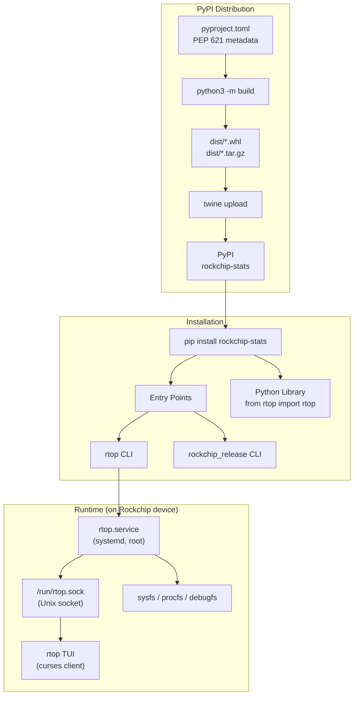

## How to Run the `rockchip_stats` Project

### 1. Install from Source (Local Development)

From inside the [`rockchip_stats/`](rockchip_stats/) directory:

```bash
# Install in editable/development mode (no sudo needed)
cd rockchip_stats
pip3 install -e .

# OR install as a regular package
pip3 install .
```

For production use on a Rockchip device, the [`setup.py`](rockchip_stats/setup.py:118) expects **root/sudo** because it installs a systemd service:

```bash
sudo pip3 install .
```

### 2. Run the CLI

Once installed, the [`pyproject.toml`](rockchip_stats/pyproject.toml:72) registers two console entry points:

| Command | Entry Point | Description |
|---------|-------------|-------------|
| `rtop` | [`rtop.__main__:main`](rockchip_stats/rtop/__main__.py:57) | Interactive curses TUI system monitor |
| `rockchip_release` | [`rtop.rockchip_release:main`](rockchip_stats/rtop/rockchip_release.py) | Print Rockchip board info |

```bash
# Start the interactive TUI monitor
rtop

# Skip the background service (standalone mode)
rtop --no-service

# Force run as the data-collection server
rtop --force

# With debug logging
rtop --debug

# Custom update interval (seconds)
rtop --interval 2.0
```

### 3. Use as a Python Library

```python
from rtop import rtop

with rtop() as rockchip:
    if rockchip.ok():
        print(rockchip.cpu)      # CPU stats
        print(rockchip.gpu)      # GPU (Mali) stats
        print(rockchip.npu)      # NPU stats
        print(rockchip.temperature)  # Thermal zones
```

### 4. Run Without Installing

```bash
# As a module
python3 -m rtop

# Or directly
python3 rockchip_stats/rtop/__main__.py
```

---

## Publishing to PyPI for `pip install rockchip-stats`

Yes — this project is **already configured for PyPI publication**. Here's what's in place and what you need to do:

### What's Already Set Up

| File | Purpose | Status |
|------|---------|--------|
| [`pyproject.toml`](rockchip_stats/pyproject.toml) | PEP 517/518/621 build config | ✅ Complete — name `rockchip-stats`, version from `rtop.__version__` |
| [`setup.py`](rockchip_stats/setup.py) | Backward compat + custom install commands | ✅ Handles systemd service installation |
| [`setup.cfg`](rockchip_stats/setup.cfg) | Wheel config + license | ✅ |
| [`MANIFEST.in`](rockchip_stats/MANIFEST.in) | sdist inclusion rules | ✅ Includes services, scripts, tests |
| [`requirements.txt`](rockchip_stats/requirements.txt) | Runtime dependency: `distro` | ✅ Also declared in pyproject.toml |

### Steps to Publish

```bash
# 1. Install build tools
pip3 install build twine

# 2. Build the package (from inside rockchip_stats/)
cd rockchip_stats
python3 -m build
# This creates:
#   dist/rockchip_stats-0.1.0.tar.gz  (source distribution)
#   dist/rockchip_stats-0.1.0-py3-none-any.whl  (wheel)

# 3. Check the package
twine check dist/*

# 4. Upload to Test PyPI first (optional but recommended)
twine upload --repository testpypi dist/*
# Then test: pip install --index-url https://test.pypi.org/simple/ rockchip-stats

# 5. Upload to real PyPI
twine upload dist/*
```

After publishing, anyone can install it with:

```bash
pip install rockchip-stats
```

### Architecture Overview



### Key Notes

- **Version** is defined at [`rtop/__init__.py:17`](rockchip_stats/rtop/__init__.py:17) (`__version__ = "0.1.0"`) and read dynamically via [`tool.setuptools.dynamic`](rockchip_stats/pyproject.toml:82).
- **Runtime dependency** is only [`distro`](rockchip_stats/pyproject.toml:63) — very lightweight.
- **The systemd service** in [`setup.py`](rockchip_stats/setup.py:67) only installs when running as root on a non-Docker Linux host, so `pip install` on a dev machine for testing is safe.
- **License** is AGPL-3.0 — make sure this is intentional for PyPI (it's a copyleft license that also requires providing source to network users).